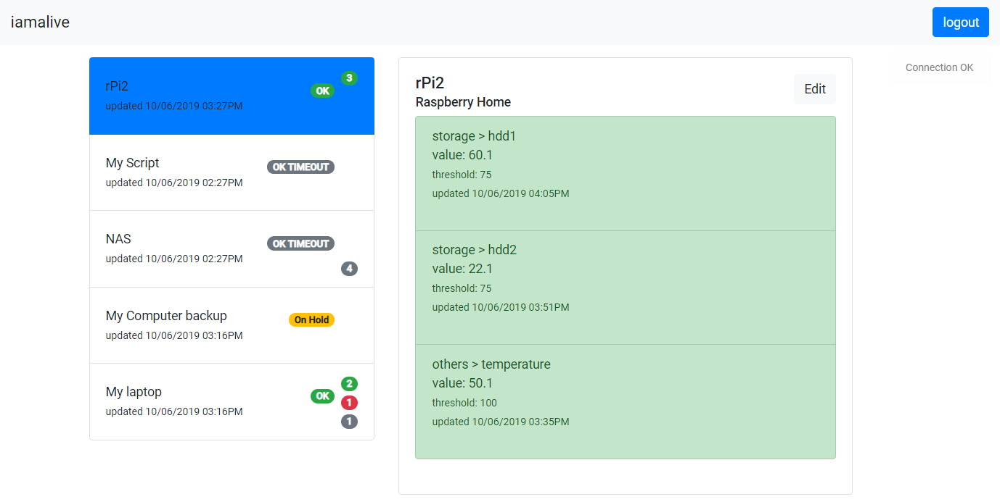

# iamalive 

## Summary
Simple tool to monitor scripts/components of the various devices I am running. 
Created with intention of deploying it on multiple 
[ESP8266](https://docs.micropython.org/en/latest/esp8266/quickref.html) running [MicroPython](https://micropython.org/).

## Technologies

- Flask Restful
- MongoDB
- Angular8

## Run demo

- clone repository
- install docker
- run ``docker-compose up``
- type in 127.0.0.1 in your web browser

## Frontend

## Backend

## Todo
- JWT (when available in micro python)
- Historical logs (Maybe [InfluxDB](https://www.influxdata.com/products/influxdb-overview/))
- Notifications (re-use [my Discord bot](https://github.com/dabku/FeedPi/blob/master/libs/discordbot.py) or emails )
- Edit/delete- full data management from frontend
